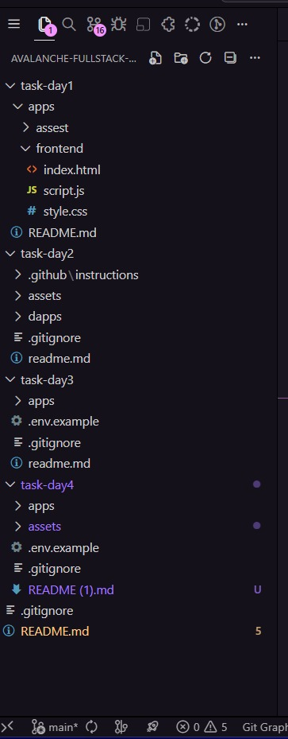
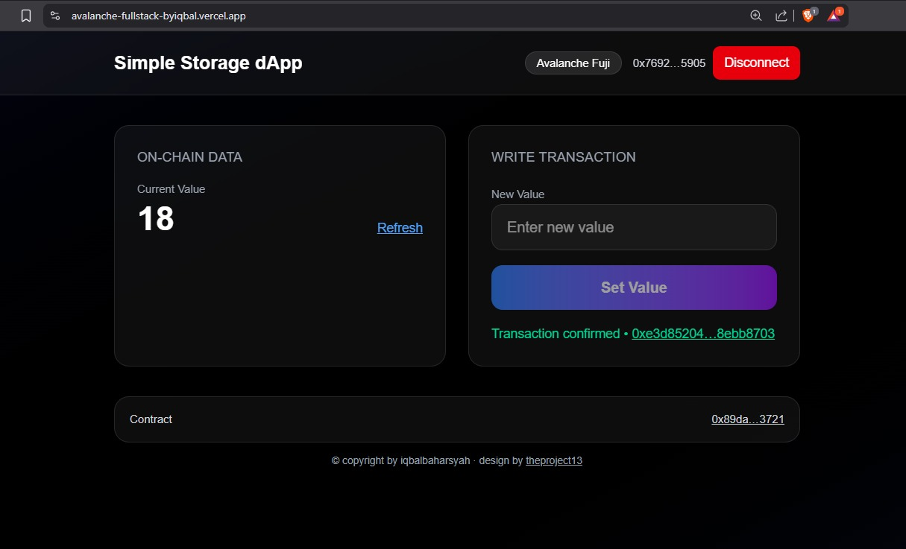
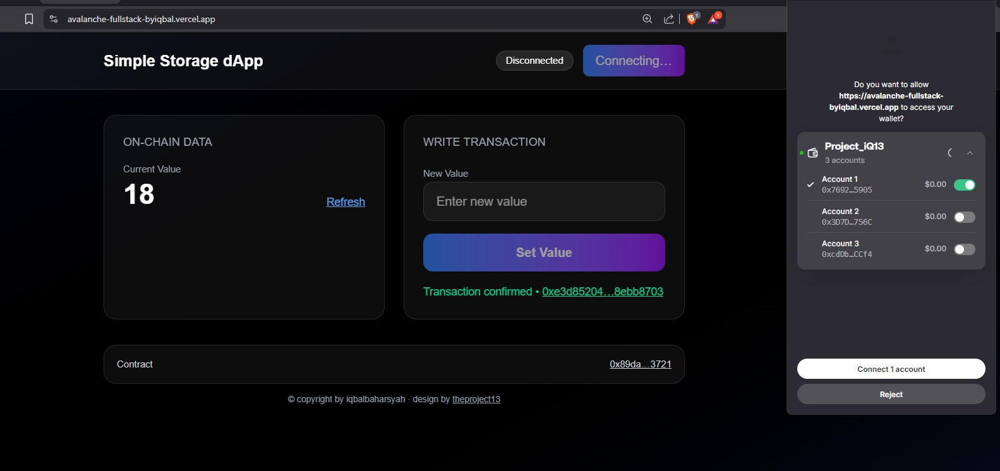
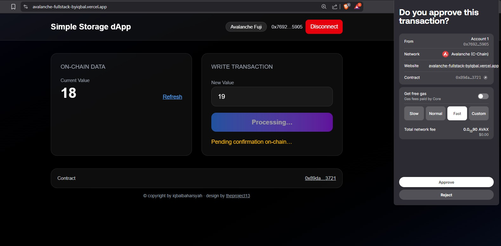
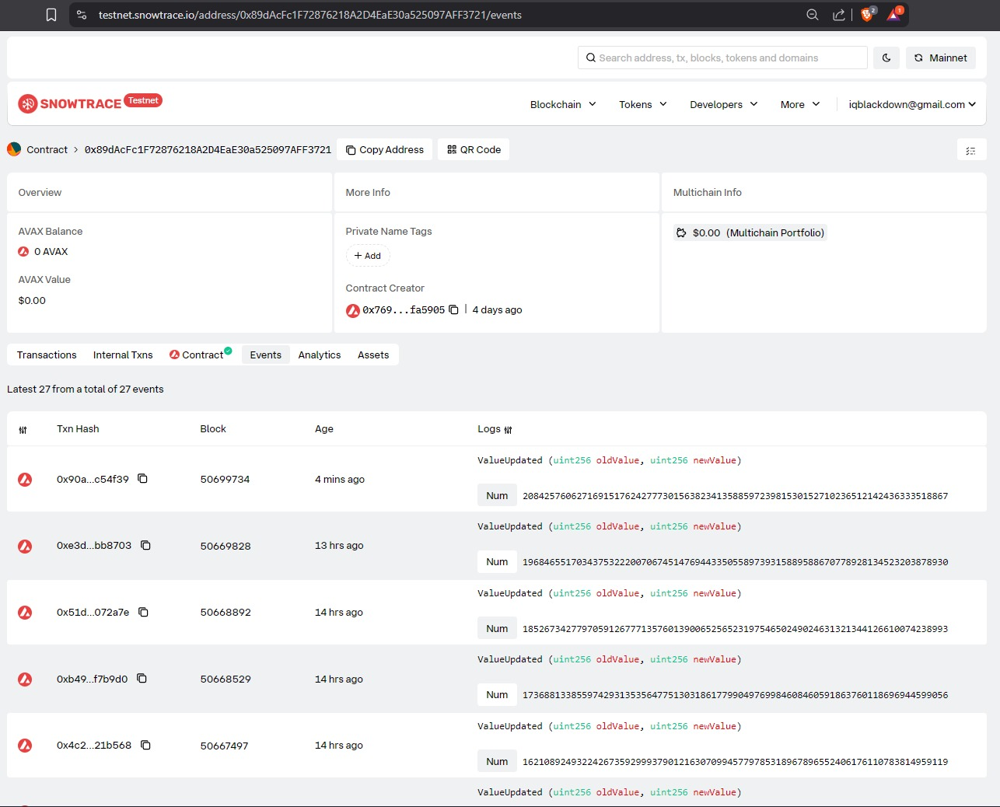
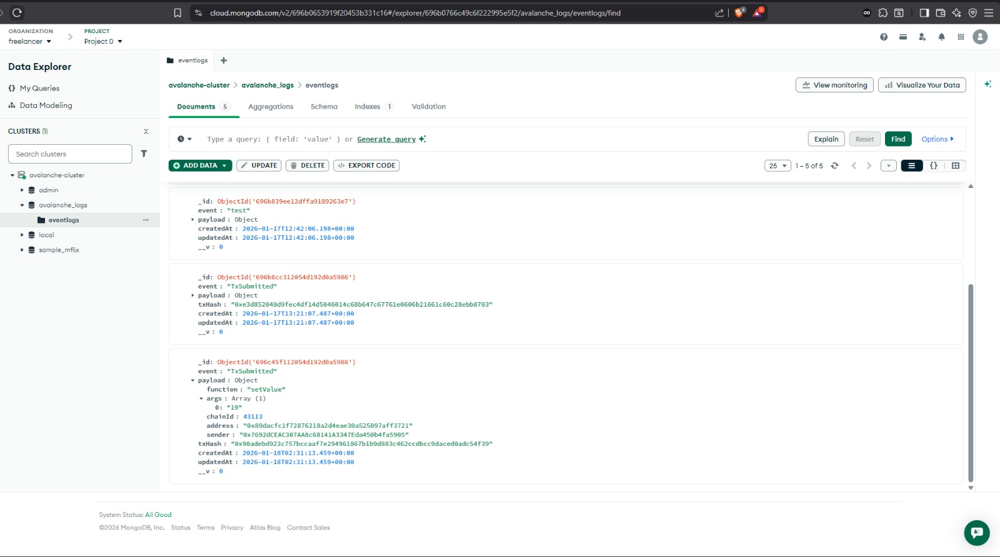
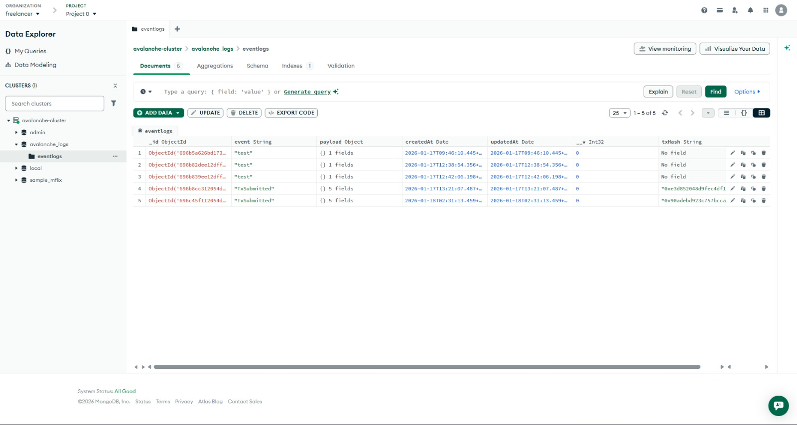

## Repository Overview

Repository ini dibuat oleh **Iqbal Baharsyah** dalam rangka mengikuti  
**Avalanche Indonesia Short Course (Day 1–5)**.

### Catatan
- Implementasi **Day 4** dan **Day 5** digabung dalam **satu repository** 🔗https://github.com/theproject13/avalanche-fullstack-dapp/tree/main/task-day4
- Tujuan penggabungan adalah untuk **mempermudah integrasi** antara:
  - Backend
  - Frontend
  - Smart Contract
- Seluruh komponen sudah dalam kondisi **siap integrasi dan deployment**

---

## Struktur Project

Berikut adalah struktur project Full Stack dApp (Monorepo):

---

## Hasil Implementasi (Final Result)

### Frontend & Wallet Integration
- Frontend berhasil terhubung ke backend
- Wallet (MetaMask / WalletConnect) berfungsi normal
- Interaksi smart contract berjalan end-to-end

---

### Blockchain & Database Integration
- Transaksi tercatat di blockchain (Snowtrace)
- Data event berhasil disimpan ke MongoDB
- Sinkronisasi on-chain dan off-chain berjalan konsisten

---

## Repository Project

Source code lengkap dapat diakses melalui:

🔗 https://github.com/theproject13/avalanche-fullstack-dapp

---

© **iqbalbaharsyah**  
Avalanche Short Course — Day 1–5
