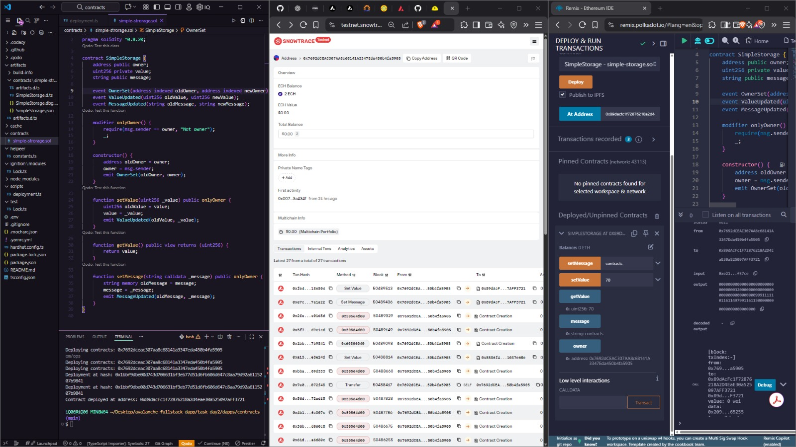
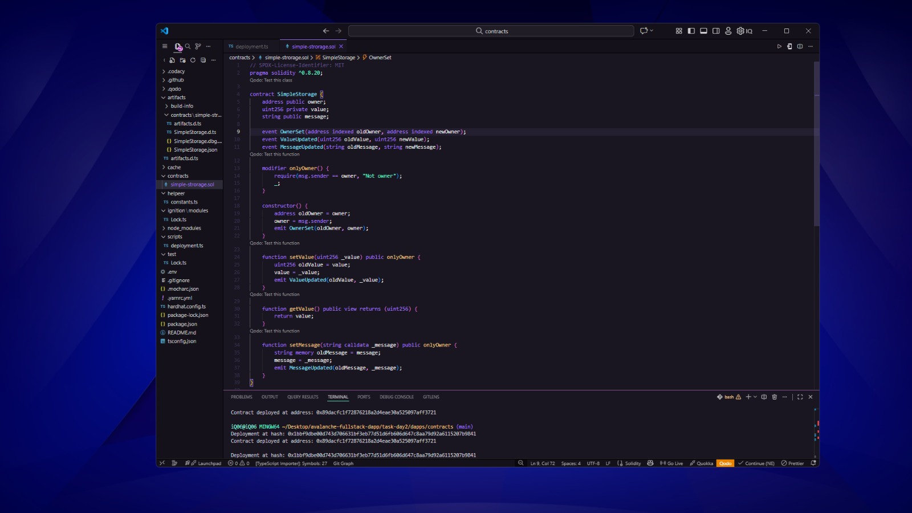
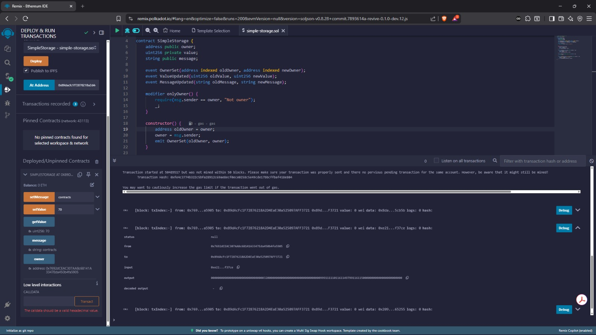
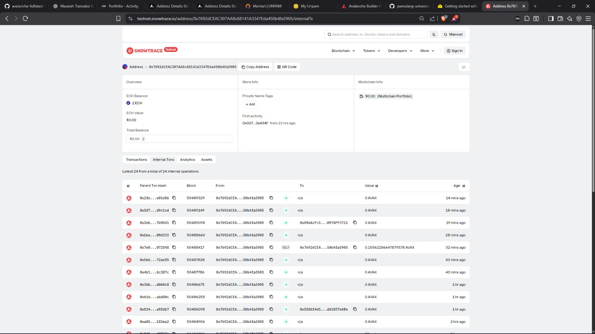
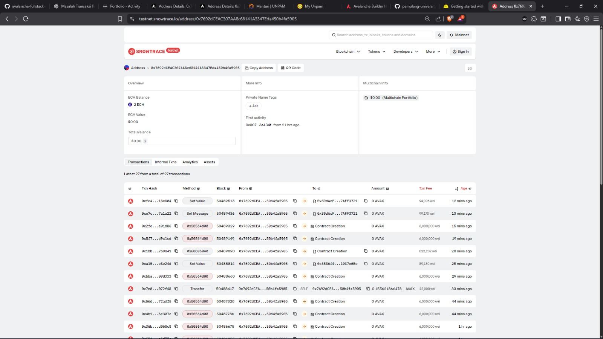

# Task Day 2 – dApp & Smart Contract (Avalanche)

**Nama:** Iqbal Baharsyah  
**Topik:** Smart Contract & dApp (Avalanche)

---

## 📌 Deskripsi
Task Day 2 berfokus pada pengembangan **smart contract dasar** dan integrasinya dengan **dApp** menggunakan jaringan **Avalanche**.  
Implementasi mencakup proses **setup environment**, **deploy contract**, serta **interaksi wallet dan ABI**.

---

## 📂 Dokumentasi

### 1. Complete Project

### 2. Project Structure

### 3. Remix Compile

### 4. Internal Contract Data (Snowtrace)

### 5. Transaction Data (Snowtrace)

---

## ✅ Task yang Diselesaikan
- Setup **Hardhat**
- Implementasi **smart contract basic**
- Deploy smart contract ke **Avalanche**
- Interaksi contract menggunakan **ABI & Wallet**
- Verifikasi transaksi melalui **Snowtrace**

---

## 🛠️ Teknologi yang Digunakan
- Solidity
- Hardhat
- Remix IDE
- Avalanche (Fuji Testnet)
- Core Wallet
- Snowtrace

---

## 📎 Catatan
Semua proses deploy dan transaksi berhasil divalidasi melalui blockchain explorer (**Snowtrace**).  
Dokumentasi visual disertakan sebagai bukti implementasi.

---
