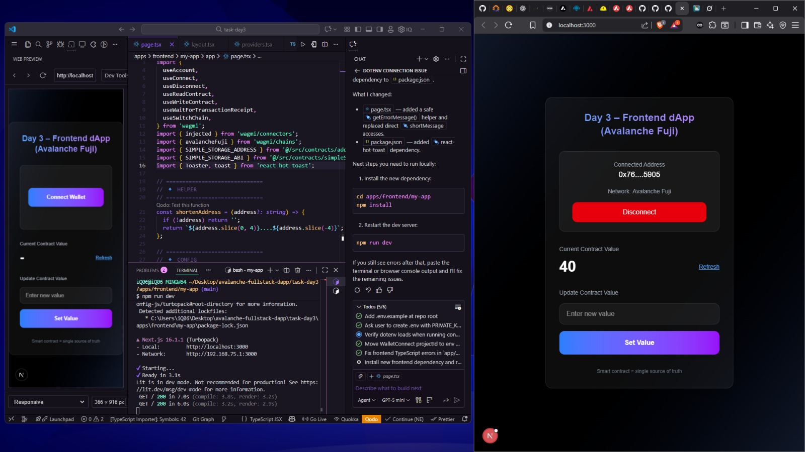
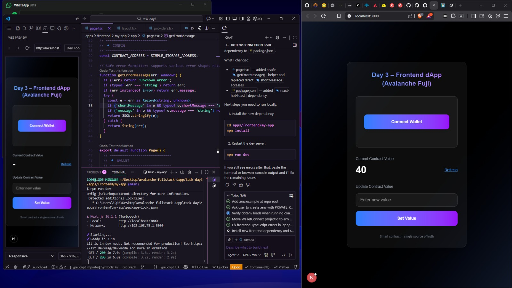
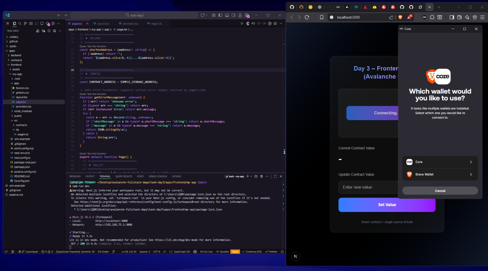
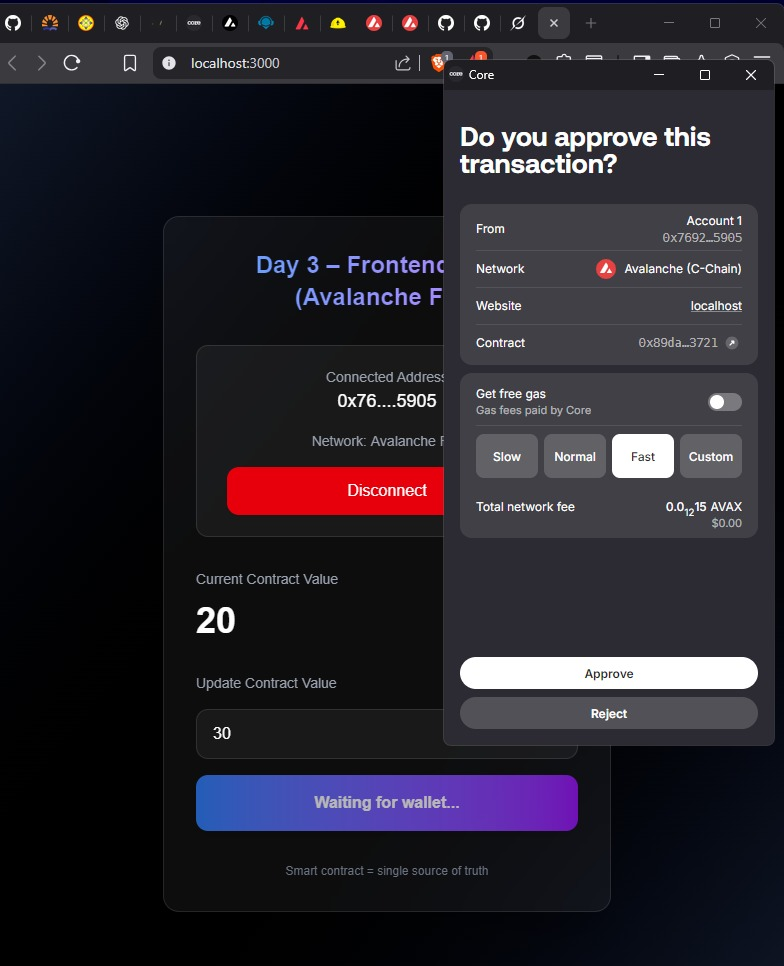
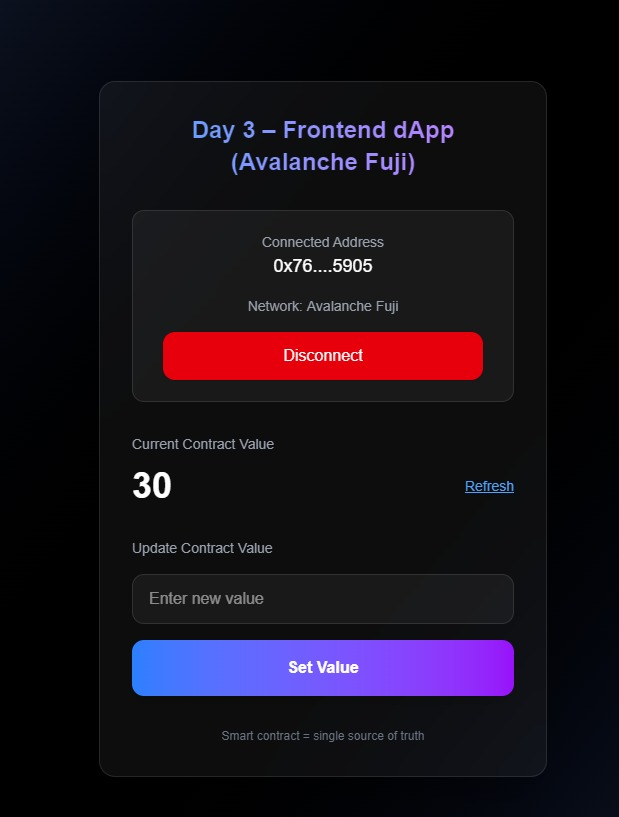

# Project dApps – Day 3 (Frontend)

Dokumentasi setup dan hasil implementasi **Frontend dApp (Next.js)** pada project **Avalanche Fullstack dApp**. Fokus Day 3 adalah integrasi wallet (WalletConnect), koneksi blockchain Avalanche, dan interaksi smart contract.

---

## 📁 Struktur Project

```text
avalanche-fullstack-dapp/
├── apps/
│   ├── frontend/     # Next.js dApp (Day 3)
│   ├── backend/      # NestJS API
│   └── contracts/    # Solidity & Hardhat (Day 2)
│
├── docs/             # Modul pembelajaran Day 1–Day 5
├── docker/           # Optional Docker setup
├── .env.example
└── README.md
```

---

## 🚀 2.1 Setup Frontend Project

Masuk ke direktori frontend:

```bash
cd apps/frontend
```

Install dependency awal:

```bash
npm install
```

Jika project belum dibuat, generate Next.js app:

```bash
npx create-next-app@latest my-app
cd my-app
```

Jalankan development server:

```bash
npm run dev
```

Akses aplikasi di browser:

```text
http://localhost:3000
```

---

## 📦 Install Dependencies dApp

Library utama untuk Web3 & state management:

```bash
npm install wagmi viem @tanstack/react-query
```

WalletConnect provider:

```bash
npm install @walletconnect/ethereum-provider
```

Notifikasi UI (opsional tapi direkomendasikan):

```bash
npm install react-hot-toast
# atau
yarn add react-hot-toast
```

Build project untuk production:

```bash
npm run build
```

---

## 🔗 Fitur yang Diimplementasikan

- Koneksi wallet menggunakan **WalletConnect**
- Support jaringan **Avalanche (Fuji / Mainnet)**
- Connect & disconnect wallet
- Permission request ke wallet
- Read value dari smart contract
- Update value dan tracking transaksi via Snowtrace

---

## 🖼️ Hasil / Result Run Project

### Connect Wallet



### Disconnect Wallet



### Update Transaction ke Snowtrace


### Permission Wallet Connection



### Permission Get Value



### Update Value Smart Contract



---

## ✅ Catatan Teknis

- Pastikan **WalletConnect Project ID** sudah dibuat dan disimpan di `.env`
- Gunakan **Avalanche Fuji** untuk testing
- `wagmi` + `viem` digunakan sebagai best practice Web3 stack modern (menggantikan ethers.js lama)
- Frontend sudah siap diintegrasikan dengan backend (NestJS) dan smart contract (Hardhat)

---

## 📌 Status

✔ Frontend dApp Day 3 – **Completed & Running Successfully**

Siap lanjut ke integrasi backend (Day 4).

