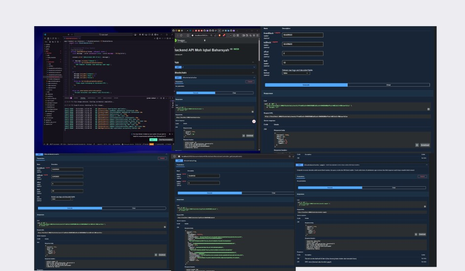
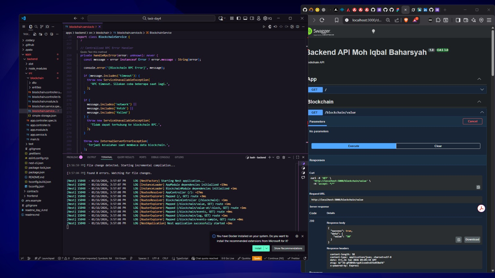
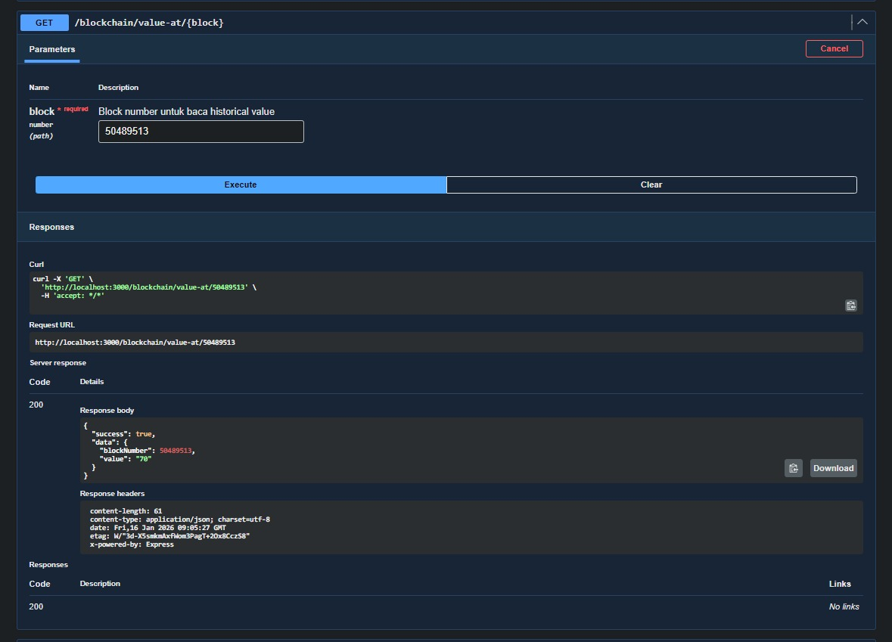
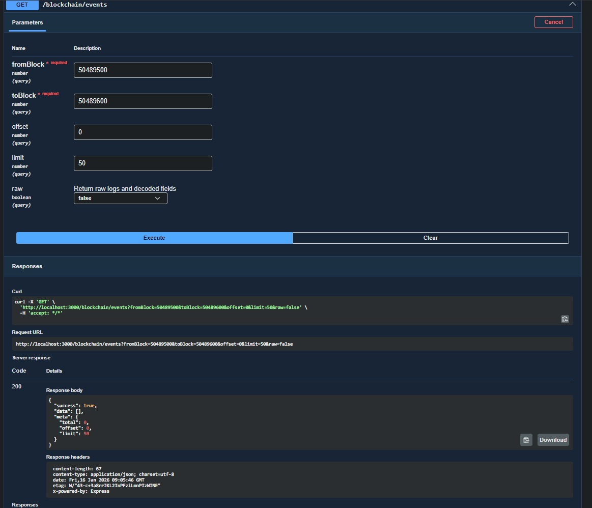
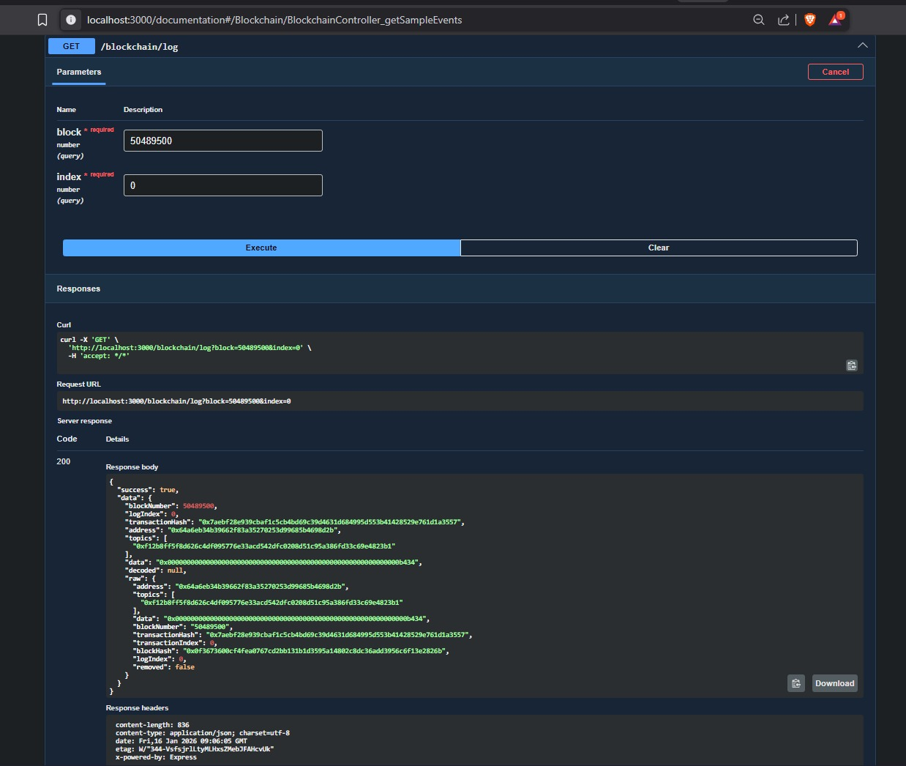
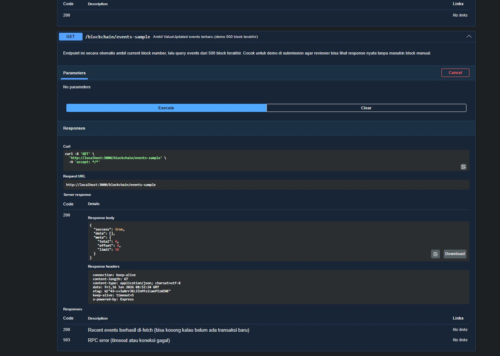
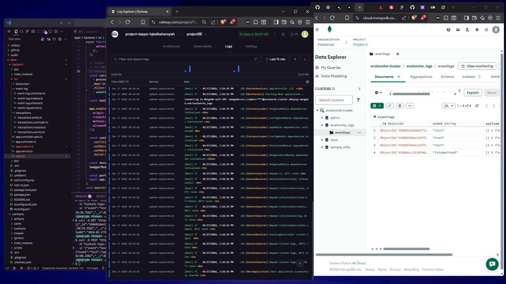

# Task day-4 dan day-5

Panduan lengkap untuk **integrasi, pengembangan, dan deployment Full Stack Web3 dApp** menggunakan **Avalanche (EVM-compatible)** dengan arsitektur **monorepo**.

Stack utama:

* **Smart Contract**: Solidity + Hardhat
* **Backend API**: NestJS + viem + MongoDB + Swagger
* **Frontend dApp**: Next.js (App Router) + wagmi + viem

---

## Arsitektur Sistem

```
Smart Contract (Avalanche)
        ↑        ↓
     viem (read-only)
        ↑
Backend API (NestJS)
        ↑
Frontend (Next.js dApp)
        ↓
 Wallet (MetaMask / WalletConnect)
        ↓
  Blockchain (Tx Write)
```

Prinsip utama:

* **Blockchain = Source of Truth**
* **Backend hanya READ (query, indexing, aggregation)**
* **Write / Tx selalu via Wallet user**

---

## Struktur Repository

```text
apps/
├─ backend/              # NestJS REST API
│  ├─ src/
│  │  ├─ blockchain/
│  │  ├─ event-log/
│  │  └─ main.ts
│  └─ package.json
│
├─ contracts/            # Hardhat + Solidity
│  ├─ contracts/
│  ├─ scripts/
│  ├─ hardhat.config.ts
│  └─ package.json
│
└─ frontend/
   └─ my-app/            # Next.js App Router
      ├─ app/
      ├─ src/
      ├─ public/
      └─ package.json

assets/
.env.example
README.md
```

---

## Prasyarat

* Node.js **LTS**
* Git
* MongoDB (Atlas / Local)
* Wallet Web3 (MetaMask / WalletConnect)
* AVAX Fuji Testnet balance

---

## Setup Lokal

### 1. Install Dependency

#### Backend

```bash
cd apps/backend
npm install
```

#### Frontend

```bash
cd apps/frontend/my-app
npm install
```

#### Smart Contract

```bash
cd apps/contracts
npm install
```

---

### 2. Environment Variables

#### Backend — `apps/backend/.env`

```env
MONGODB_URI=mongodb+srv://<user>:<password>@<cluster>/<database>
CORS_ORIGIN=http://localhost:3000
CONTRACT_ADDRESS=0x<alamat_kontrak_fuji>
POSTGRES_ENABLE=false
```

#### Frontend — `apps/frontend/my-app/.env.local`

```env
NEXT_PUBLIC_API_BASE=http://localhost:3001
NEXT_PUBLIC_CONTRACT_ADDRESS=0x<alamat_kontrak_fuji>
```

#### Smart Contract — `apps/contracts/.env` (opsional)

```env
RPC_URL=https://api.avax-test.network/ext/bc/C/rpc
PRIVATE_KEY=0x...
```

⚠️ **JANGAN PERNAH COMMIT PRIVATE KEY**

---

## Menjalankan Lokal

### Backend

```bash
cd apps/backend
npm run start:dev
```

URL:

```
- **Local**:  
   http://localhost:3001

   atau 

   http://localhost:3001/swagger-ui/documentation

   atau

- **Production**:  
   https://<masukanlinkbe yg sudah dideploy>.up.railway.app/swagger-ui/documentation
```

Endpoint utama:

* `GET /blockchain/value`
* `GET /blockchain/value-at/:block`
* `GET /blockchain/events`
* `GET /blockchain/log`
* `GET /blockchain/events-sample`
* `POST /event-logs`
* `GET /event-logs`

Swagger:

```
/documentation
```

---

### Frontend

```bash
cd apps/frontend/my-app
npm run dev
```

URL:

```
http://localhost:3000
```

---

### Smart Contract

```bash
cd apps/contracts
npx hardhat compile
npx hardhat run scripts/deployment.ts --network fuji
```

Setelah deploy:

1. Salin **contract address**
2. Update ke:

   * `backend/.env`
   * `frontend/.env.local`
3. Restart backend & frontend

---

## Alur Integrasi (End-to-End)

### Read Data

```
Frontend → Backend API → viem → Blockchain
```

### Write Transaction

```
Frontend → Wallet → Blockchain
```

Backend **tidak pernah** sign transaksi.

---

## Deployment Production

### Backend — Railway

1. Script `package.json`:

```json
{
  "build": "nest build",
  "start:prod": "node dist/main"
}
```

2. Set env Railway:

```env
MONGODB_URI=mongodb+srv://...
CORS_ORIGIN=https://<frontend>.vercel.app,https://<preview>.vercel.app
CONTRACT_ADDRESS=0x...
```

---

### Frontend — Vercel

```env
NEXT_PUBLIC_API_BASE=https://<backend>.up.railway.app
NEXT_PUBLIC_CONTRACT_ADDRESS=0x...
```

Env dibaca saat **build** → ubah env = **redeploy**.

---

## Day 5 Checklist

* [ ] Frontend konsumsi Backend API
* [ ] Transaksi via wallet
* [ ] Environment terpisah
* [ ] Backend live
* [ ] Frontend live
* [ ] End-to-end sukses

---

## Troubleshooting

### CORS Error

* `CORS_ORIGIN` harus match domain Vercel
* Redeploy backend

### Test API

```bash
curl -X POST "https://<backend>.up.railway.app/event-logs" \
  -H "Content-Type: application/json" \
  -d '{"event":"from-vercel","payload":{"t":123}}'

curl -X GET "https://<backend>.up.railway.app/event-logs"
```

---

#Result Day-4









### Result Day 5

**Integrasi Backend, Frontend, Smart Contract, dan Database (MongoDB)**  
dengan konfigurasi **request timeout 2000 ms**.

### Live dApp
Aplikasi dApp telah berhasil dideploy dan dapat diakses melalui:

🔗 https://avalanche-fullstack-byiqbal.vercel.app/

---

### Screenshot Hasil Implementasi

#### 1. Frontend Terhubung ke Backend


#### 2. Popup Wallet (WalletConnect / CoreWallet)


#### 3. Konfirmasi Pembacaan Nilai Smart Contract


#### 4. Event Log Tercatat di Backend


#### 5. Transaksi Tercatat di Snowtrace


#### 6. Data Tersimpan di Database MongoDB


#### 7. Verifikasi Data di Database


© **iqbalbaharsyah**
Avalanche Short Course — Day 1–5
